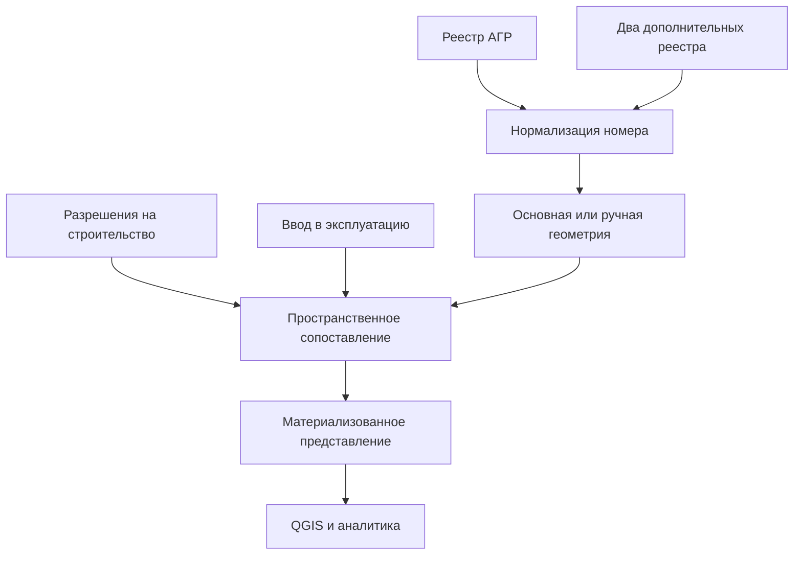

# «Сводные данные по АГР»: интеграция пространственных и табличных источников

Обезличенная демонстрация ETL-процесса для формирования единого слоя по архитектурно-градостроительным решениям (АГР). Репозиторий показывает общую архитектуру решения на синтетических данных и не содержит производственный SQL, рабочие геометрии, внутренние схемы или параметры подключения.

## Производственный контекст

Решение спроектировано с нуля в июле 2025 года. Итоговый слой объединяет семь разнородных источников, содержит 18 487 объектов и 126 атрибутов. Он используется ГИС-специалистами, аналитиками и градостроителями, а агрегированные показатели — в управленческой статистике и дашбордах.

Материализованное представление обновляется `CONCURRENTLY` каждые 30 минут через cron; типичное время обновления — около 97 секунд.

## Логика демоверсии



- основной ключ — нормализованный номер документа АГР;
- пробелы, регистр и пустые значения приводятся к единому виду;
- при отсутствии основной геометрии используется ручное дополнение;
- объекты разрешительной документации без номера АГР присоединяются по пересечению;
- разовые табличные дополнения включаются в общий набор ключей;
- уникальный индекс позволяет выполнять конкурентное обновление;
- GiST-индекс готовит итоговый слой к работе в ГИС.

## Структура

```text
sql/01_setup.sql             — семь входных таблиц
sql/02_sample_data.sql       — синтетические данные
sql/03_materialized_view.sql — очистка, объединение и индексы
sql/04_refresh.sql           — конкурентное обновление
cron/refresh.example         — безопасный пример расписания
```

## Запуск

```bash
psql -d your_database -f sql/01_setup.sql
psql -d your_database -f sql/02_sample_data.sql
psql -d your_database -f sql/03_materialized_view.sql
psql -d your_database -f sql/04_refresh.sql
```

---

# Consolidated AGR data: spatial and tabular integration

An anonymized ETL demonstration for building a consolidated architectural and urban-planning layer. The production-inspired workflow was designed in July 2025 and combines seven heterogeneous sources into 18,487 features with 126 attributes. It supports GIS users, analysts, urban planners, management statistics, and dashboards.

The demo normalizes document identifiers, fills missing geometry from a manual source, spatially matches permit data without AGR identifiers, materializes the result, and adds the indexes required for concurrent refresh and GIS access. All included records and geometries are synthetic.

## License

MIT
